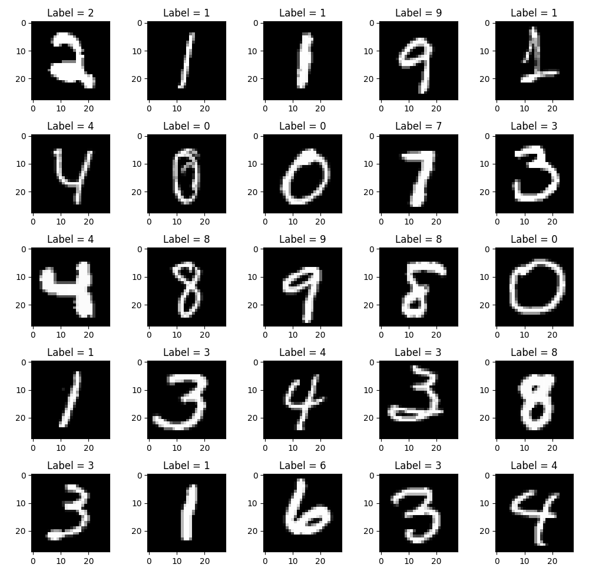
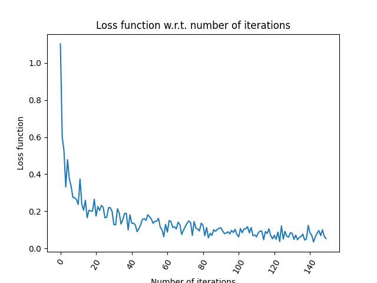
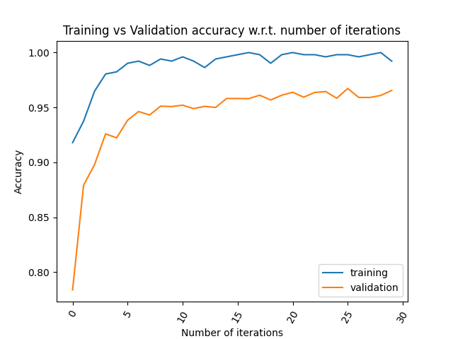
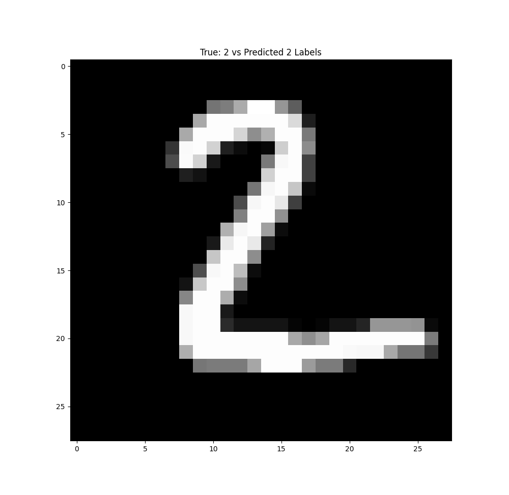

# MNIST-TensorFlow
Solve the classical MNIST multiclass image classification problem by creating a Feed Forward
Neural Network from scratch.

Methods Implemented:
- Activation Functions
- Gradients
- Forward Propagation
- Back Propagation
- Derivative of loss w.r.t. weights
- Derivative of loss w.r.t. input
- Weight updates
- Full train cycle

Activation Functions
 

## MNIST Solution:
Problem type: Classification (10 classes)

Neural Network loss function: Cross Entropy  

#### Neural Network Structure
Create a Neural Network which have the following layers:
- Input: **784** nodes with a Relu activation function
- Hidden Layer: **300** Nodes with a Relu activation function
- Output Layer: **10** Nodes with softmax activation function

#### Training Data
 

#### Training 
|    Training Loss wrt Iterations    | Training and Validation Accuracy |
|:----------------------------------:|:--------------------------------:|
|                                    |                                  |
|  |     |

#### Predictions 
Example of an image with the true label of 2 and a predicted label of 2.
 

#### Accuracy
Final Test Set accuracy is **97.1%**
